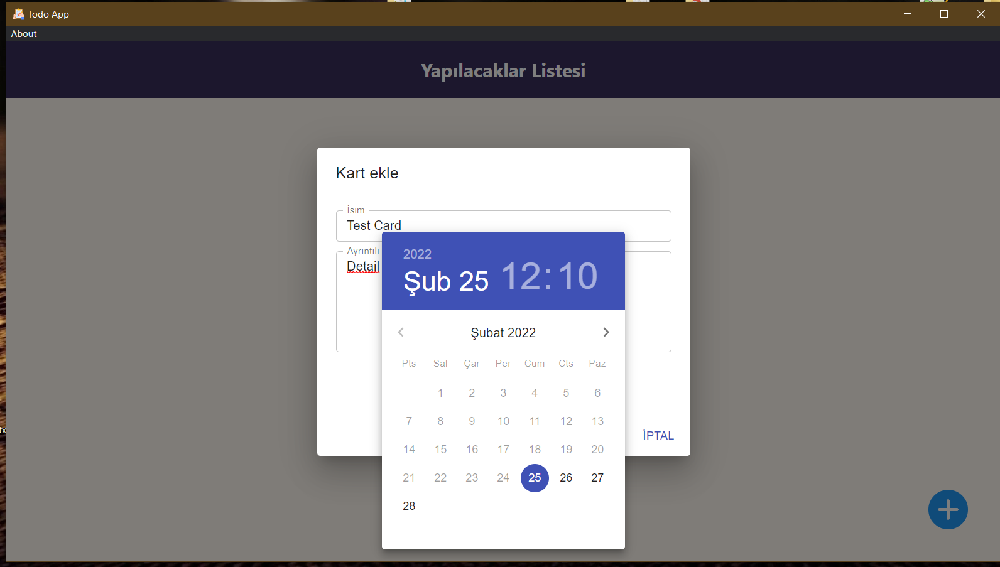
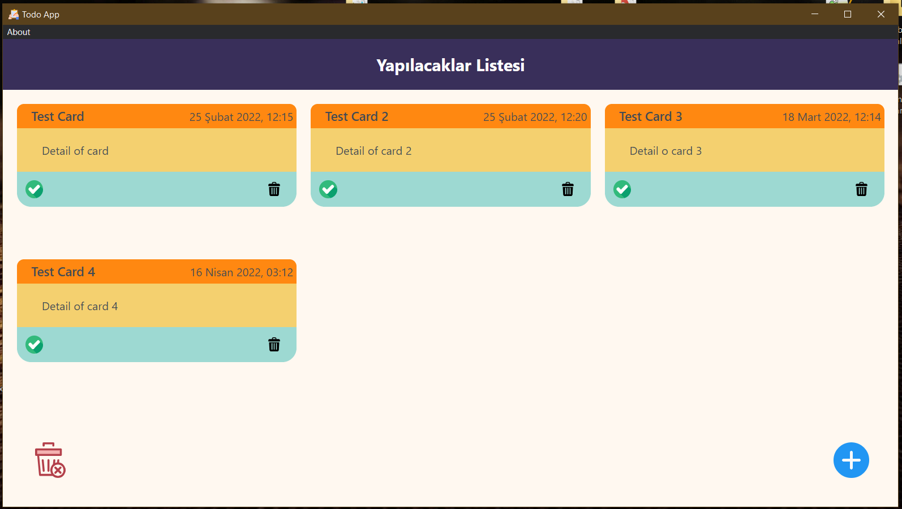
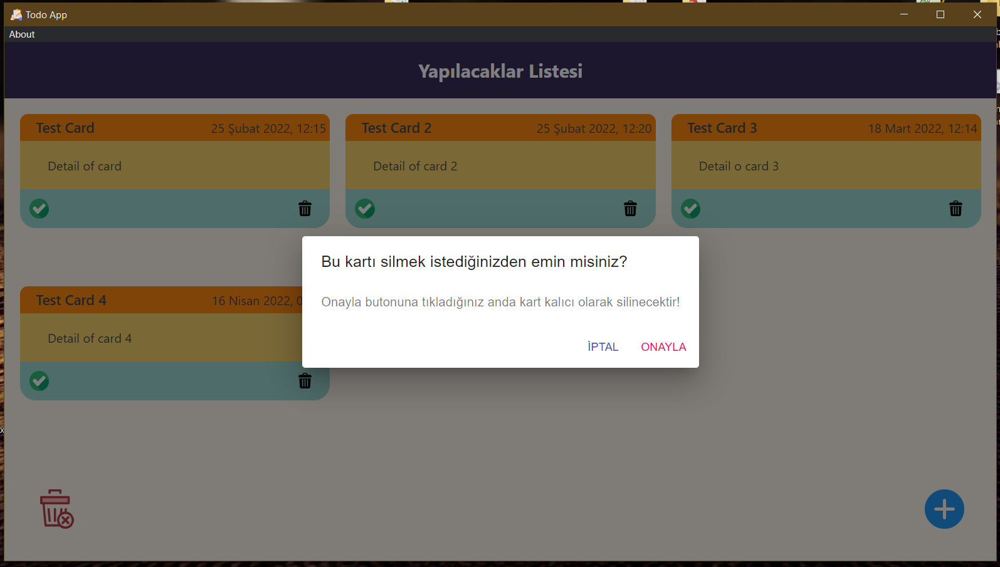
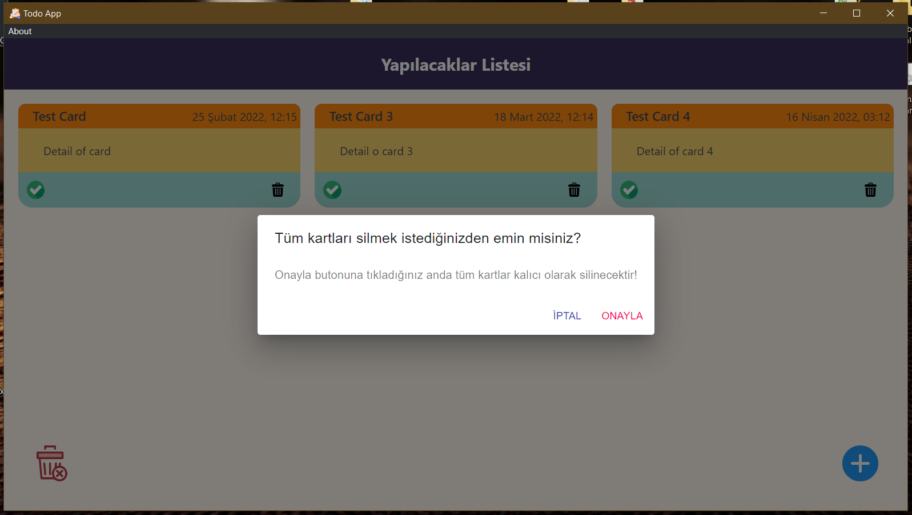
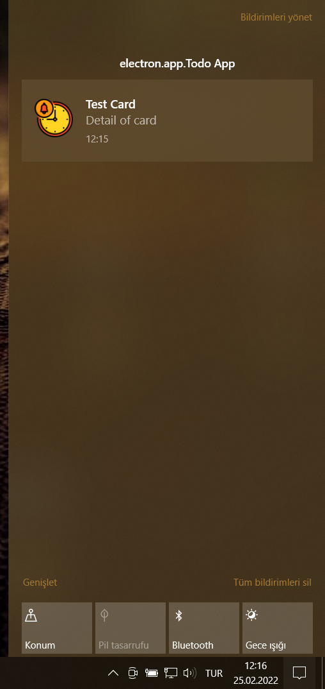

# Electron.js and React.js Todo App

A desktop to do application that is made with Electron.js and React.js.

## Screenshots

## Used Main Libraries

[Electron.js](https://www.electronjs.org) - Version: 13.1.2

[React.js](https://reactjs.org) - Version: 17.0.2

[Electron Builder](https://www.electron.build) - Version: 22.14.13
